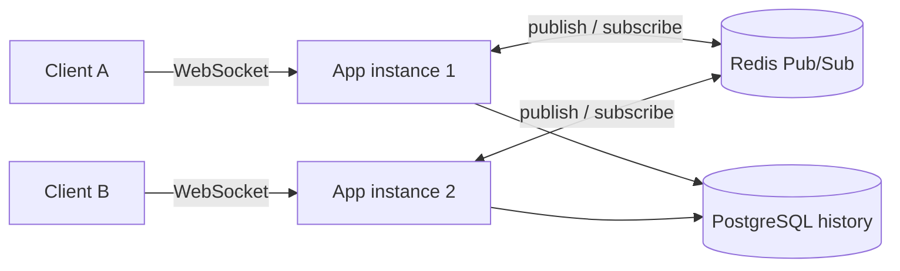
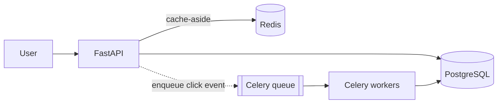

<!-- Header banner -->
<div align="center">


<!-- Typing animation -->
<a href="https://github.com/Sudhanshukumar0007">
  
</a>

<br/>


</div>

---

## 👋 About me

I'm obsessed with the gap between **"a model that works in a notebook"** and **"a system that actually ships."**
Most of my work lives in that gap: RAG pipelines, real-time systems, and full-stack apps with AI baked in.

```python
class Sudhanshu:
    role     = "B.Tech CSE (AI) @ KIET, 2024-2028"
    focus    = ["Backend", "Distributed Systems", "LLM apps"]
    currently = ["Leading GSSoC 2026 project", "Writing Backprop Diaries", "Building in public"]
    certs    = ["AWS Cloud Practitioner", "ML Specialization (Coursera)"]

    def motto(self):
        return "Make it work, make it measurable, make it ship."
```

---

## 🚀 What I'm building right now

| Project | What it does | Stack |
|---|---|---|
| **[PulseRoom](https://github.com/Sudhanshukumar0007)** | Real-time chat backend that scales horizontally across instances | `FastAPI` `WebSockets` `Redis Pub/Sub` |
| **[LinkVault](https://github.com/Sudhanshukumar0007)** | URL shortener with non-blocking analytics, rate limiting and RBAC | `FastAPI` `PostgreSQL` `Redis` `Celery` `Docker` |
| **[Aaira](https://github.com/Sudhanshukumar0007)** | Agentic desktop assistant with face recognition and cross-session memory | `LangChain` `ChromaDB` `MongoDB` |
| **[CognitiveSB](https://github.com/Sudhanshukumar0007)** | Open-source RAG study engine with four tutoring modes | `LangGraph` `FAISS` `Flask` `Celery` |

---

## 📌 Featured projects

> 👇 Click any project to expand the details and architecture.

<details>
<summary><b>⚡ PulseRoom</b> — Distributed real-time chat backend</summary>
<br/>

- Fans out WebSocket events over **Redis Pub/Sub**, so multiple app instances can serve one chat room.
- **No message loss on reconnect:** clients send `last_seen_message_id` and catch up from durable PostgreSQL history.
- **Presence and typing indicators** use ephemeral Redis TTL keys, so there is no persistent state to clean up.



**Stack:** FastAPI · AsyncIO · PostgreSQL · Redis · WebSockets · Docker Compose
[🔗 Live demo](https://github.com/Sudhanshukumar0007) · [📂 Source](https://github.com/Sudhanshukumar0007)

</details>

<details>
<summary><b>🔗 LinkVault</b> — URL shortener & analytics system</summary>
<br/>

- **27+ integration tests** (pytest) gated behind a GitHub Actions CI pipeline.
- **Fast redirects:** click analytics are offloaded to Celery workers behind a Redis cache-aside layer.
- **Abuse protection:** atomic token revocation and sliding-window rate limiting on Redis sorted sets, with a fail-open fallback if the cache goes down.
- **Safe schema changes** via SQLAlchemy 2.0 async sessions and Alembic migrations.



**Stack:** FastAPI · PostgreSQL · Redis · Celery · SQLAlchemy · Alembic · Docker
[🔗 Live API](https://github.com/Sudhanshukumar0007) · [📂 Source](https://github.com/Sudhanshukumar0007)

</details>

<details>
<summary><b>🤖 Aaira</b> — Modular agentic desktop assistant</summary>
<br/>

- Multi-model pipeline (**Llama 3.3, GPT-4o, Qwen3**) that parses and executes commands.
- Tools: headless web browsing, shell execution, file I/O and UI control, all behind a **secure confirmation gate**.
- **Face recognition + memory:** InsightFace embeddings stored in ChromaDB and MongoDB for personalized, persistent sessions.

**Stack:** FastAPI · LangChain · ChromaDB · MongoDB · WebSocket
[📂 Source](https://github.com/Sudhanshukumar0007)

</details>

<details>
<summary><b>🧠 CognitiveSB</b> — Open-source RAG study engine (GSSoC 2026 · Project Admin)</summary>
<br/>

- Coordinating **10+ external contributors** and reviewing and merging PRs, including a path traversal security fix, Celery/Redis async integration, FAISS session isolation and centralized validation.
- Async **LangGraph** RAG pipeline with four tutoring modes: *Socratic, Feynman, Simple, Exam Prep*.
- Turns PDFs and YouTube transcripts into structured notes, mind maps and **SM-2 spaced-repetition flashcards**.

**Stack:** LangChain · LangGraph · FAISS · Flask · Celery · Redis
[📂 Source](https://github.com/Sudhanshukumar0007)

</details>

---

## 🛠️ Tech stack

<div align="center">

**Languages**<br/>


**Backend & Data**<br/>


**DevOps & Cloud**<br/>


**AI / ML** — LangChain · LangGraph · FAISS · ChromaDB · RAG · LLMs

</div>

---

## 📊 GitHub stats

<div align="center">


</div>

<!-- Optional: contribution snake (needs the snk GitHub Action, see notes) -->
<!--
<div align="center">
  
</div>
-->

---

## 🏆 Achievements & certifications

- ☁️ **AWS Certified Cloud Practitioner**
- 🎓 **Machine Learning Specialization** — Coursera (Andrew Ng)
- 🧩 **330+ LeetCode problems** in C++ · 57-day max streak · contest rating **1,627** (top 20.87% globally)
- 🌍 **GSSoC 2026 Project Admin** — leading an open-source AI project end to end

---

## ✍️ Writing

I write **[Backprop Diaries](https://backpropdiaries.hashnode.dev)**, documenting my AI/ML learning journey in public.

---

## 📫 Let's connect

<div align="center">

<a href="https://github.com/Sudhanshukumar0007"></a>
<a href="https://www.linkedin.com/in/YOUR-LINKEDIN"></a>
<a href="mailto:sudhanshu.kumar.aidev007@gmail.com"></a>
<a href="https://YOUR-PORTFOLIO-URL"></a>
<a href="https://backpropdiaries.hashnode.dev"></a>

<br/><br/>


</div>
