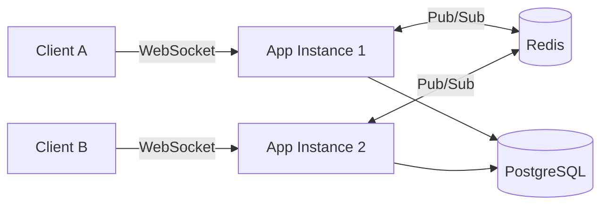
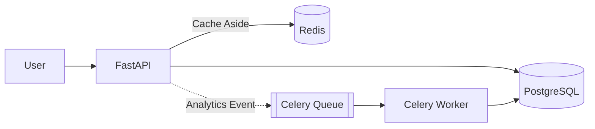

<!-- Header -->

<div align="center">


<a href="https://github.com/Sudhanshukumar0007">

</a>

<br/>


</div>

---

## 👋 About Me

I'm interested in the engineering side of AI — **how models become reliable systems rather than just notebook experiments.**

I work across backend engineering, distributed systems, and applied AI, with a particular interest in:

* 🤖 RAG systems and LLM applications
* 🧠 AI agents and tool-using systems
* ⚡ Async and real-time backends
* 🗄️ Databases, caching and distributed architectures
* ☁️ Cloud infrastructure and deployment
* 🧩 System design and scalable APIs

```python
class Sudhanshu:
    role = "B.Tech CSE (AI) @ KIET"
    
    focus = [
        "Backend Engineering",
        "Distributed Systems",
        "Applied AI"
    ]

    currently = [
        "Building AI-powered systems",
        "Learning system design",
        "Contributing to open source"
    ]

    motto = "Make it work. Make it measurable. Make it ship."
```

---

## 🚀 What I'm Building

| Project         | Description                                                        | Stack                                       |
| --------------- | ------------------------------------------------------------------ | ------------------------------------------- |
| **PulseRoom**   | Real-time chat backend designed for multi-instance deployments     | `FastAPI` `WebSockets` `Redis` `PostgreSQL` |
| **LinkVault**   | URL shortener with analytics, rate limiting and background workers | `FastAPI` `PostgreSQL` `Redis` `Celery`     |
| **Aaira**       | Modular AI desktop assistant with tools and persistent memory      | `FastAPI` `LangChain` `MongoDB` `ChromaDB`  |
| **CognitiveSB** | Open-source RAG study engine with multiple tutoring modes          | `LangGraph` `FAISS` `Flask` `Celery`        |

---

## 📌 Featured Projects

### ⚡ PulseRoom

**Distributed real-time chat backend**

A backend designed to explore the problems that appear when a real-time application moves beyond a single server.

* WebSocket-based real-time communication
* Redis Pub/Sub for cross-instance event propagation
* PostgreSQL for durable message history
* Reconnection flow using the client's last-seen message ID
* Redis TTL keys for ephemeral presence and typing state



**Stack:** FastAPI · AsyncIO · PostgreSQL · Redis · WebSockets · Docker

[📂 Source](https://github.com/Sudhanshukumar0007)

---

### 🔗 LinkVault

**URL shortener & analytics backend**

A backend project focused on API design, caching, asynchronous processing and abuse protection.

* Redis cache-aside strategy for frequently accessed data
* Celery workers for asynchronous analytics processing
* Sliding-window rate limiting using Redis sorted sets
* Token revocation
* PostgreSQL persistence
* SQLAlchemy 2.0 + Alembic migrations
* Automated testing with pytest and GitHub Actions



**Stack:** FastAPI · PostgreSQL · Redis · Celery · SQLAlchemy · Alembic · Docker

[📂 Source](https://github.com/Sudhanshukumar0007)

---

### 🤖 Aaira

**Modular agentic desktop assistant**

An experimental AI assistant exploring tool use, memory and multimodal interaction.

* Multi-model LLM pipeline
* Tool-based command execution
* Web browsing and file interaction
* Persistent conversation memory
* Face-recognition-based personalization
* ChromaDB + MongoDB for memory storage

**Stack:** FastAPI · LangChain · ChromaDB · MongoDB · WebSockets

[📂 Source](https://github.com/Sudhanshukumar0007)

---

### 🧠 CognitiveSB

**Open-source RAG study engine · GSSoC 2026**

An AI-powered study platform built around retrieval-augmented generation and structured learning workflows.

* LangGraph-based asynchronous RAG pipeline
* Four tutoring modes:

  * Socratic
  * Feynman
  * Simple Explanation
  * Exam Preparation
* PDF and YouTube transcript processing
* Structured notes and mind maps
* SM-2 spaced-repetition flashcards
* Celery + Redis for asynchronous workloads
* Open-source project administration and PR reviews

**Stack:** LangChain · LangGraph · FAISS · Flask · Celery · Redis

[📂 Source](https://github.com/Sudhanshukumar0007)

---

## 🛠️ Tech Stack

### Languages

<div align="center">


</div>

### Backend & Databases

<div align="center">


</div>

### Cloud, DevOps & Infrastructure

<div align="center">


</div>

### AI / ML

<div align="center">

`LangChain` · `LangGraph` · `FAISS` · `ChromaDB` · `RAG` · `LLMs` · `Agents`

</div>

---

## 🧠 What I'm Learning

```text
Backend Engineering
├── API design
├── Async systems
├── Caching
├── Message queues
└── Distributed systems

Applied AI
├── RAG
├── Agent architectures
├── LLM evaluation
├── Embeddings
└── Model serving

System Design
├── Scalability
├── Reliability
├── Data consistency
├── Observability
└── Fault tolerance
```

---

## 📊 GitHub Activity

<div align="center">


<br/>


<br/>


</div>

---

## 🏆 Achievements

* ☁️ **AWS Certified Cloud Practitioner**
* 🎓 **Machine Learning Specialization** — Coursera
* 🧩 **330+ LeetCode problems**
* 🔥 **57-day maximum LeetCode streak**
* 🏅 **1,627 LeetCode contest rating**
* 🌍 **GSSoC 2026 Project Admin**
* 👨‍💻 Open-source contributor and project maintainer

---

## ✍️ Writing

I document my AI/ML learning journey through **Backprop Diaries** — experiments, concepts, failures and things I learn while building.

**[Read Backprop Diaries →](https://backpropdiaries.hashnode.dev)**

---

## 📫 Connect

<div align="center">

<a href="https://github.com/Sudhanshukumar0007">

</a>

<a href="https://www.linkedin.com/in/YOUR-LINKEDIN">

</a>

<a href="mailto:sudhanshu.kumar.aidev007@gmail.com">

</a>

<a href="https://YOUR-PORTFOLIO-URL">

</a>

<a href="https://backpropdiaries.hashnode.dev">

</a>

</div>

---

<div align="center">

### *Build → Measure → Learn → Ship*


</div>
